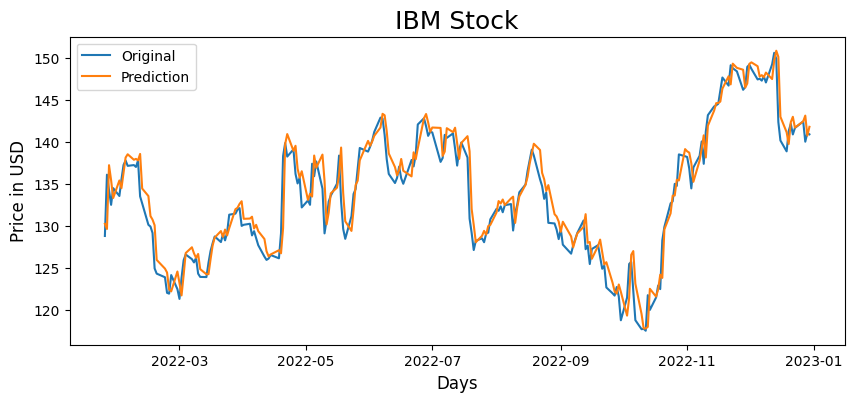

# Stock Price Predictor
A demonstration of how to make a time series model in PyTorch to predict the price of a stock. The model uses multiple LSTMs (Long Short-term Memory) followed by fully connected layers. The API used to get the price data of a stock is provided by [Alpha Vantage](https://www.alphavantage.co/).

There are two Python Notebooks in this repo:
  * The [first](IBM_Stock_Training.ipynb) is for creating, training, and saving the model. [Google Colab Link](https://colab.research.google.com/github/ali46-2/stock_price_predictor/blob/master/IBM_Stock_Training.ipynb)
  * The [second](IBM_Stock_Inference.ipynb) is for loading the model, and predicting the price of the stock for the next day. [Google Colab Link](https://colab.research.google.com/github/ali46-2/stock_price_predictor/blob/master/IBM_Stock_Inference.ipynb)

  

